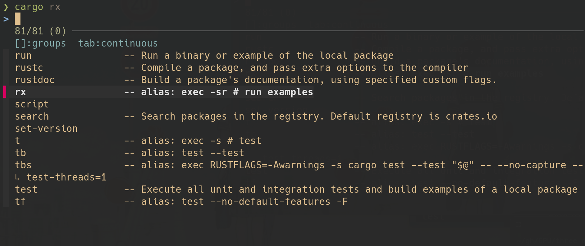

# cargo-exec [](https://crates.io/crates/cargo-alias-exec) [](https://github.com/squirreljetpack/cargo-exec/blob/main/LICENSE)

A tiny script extending cargo aliases to arbitrary commands.

Something like git aliases and npm run, in cargo.

If you have the completion setup for it, you can also see your aliases with their definitions:



# Steps

`cargo install cargo-alias-exec` (or `cargo install --path .` if cloning).

Add the following to `$PROJECT_DIR/.cargo/config.toml` or `~/.cargo/config.toml` ([See](https://doc.rust-lang.org/cargo/reference/config.html))

```toml
[alias]
crumpets = 'clippy -- --allow warnings' # all cargo aliases are interpreted as cargo subcommands

# cargo-exec allows you to get around this limitation
# just prefix your command with 'exec'
declare = [
  'exec',
  'echo',
]

```

then run `cargo exec declare words`.

# Arguments

You can define an inline shell script using the `-s` flag:

```toml
[alias]
taste = ['exec', '-s', 'zsh', 'rustc $1 && ./${1%.*}']

# If only one argument follows, `$SHELL` is used
tea = ['exec', '-s', '''
if cargo tree --workspace --edges dev --depth 1 --prefix none | grep -q '^insta'; then
  eval cargo insta test --review "$_LEFT_ARGS" -- "$_RIGHT_ARGS"
else
  cargo test "$@"
fi''']
```

and then invoke with `cargo taste script.rs`.

When `-s` is absent, environment variables in your arguments are evaluated before being passed to the main command. This is a convenience provided to make it easier to define aliases in cases like the following:

```toml
[alias]
toast = "exec cargo run -i brioche -o $HOME/counter/" # to prevent evaluation, escape $ like so: \$HOME
```

# Environment variables

For your convenience, a few environment variables are set inside the shell:

- `CARGO_PREFIX` finds the nearest ancestor directory with `Cargo.toml`
- `_LEFT_ARGS` and `_RIGHT_ARGS` contain the input arguments split at `--`, and are useful when wrapping other cargo subcommands:

```toml
cc = [
  'exec',
  '-s',
  'sh',
  'if [ -e "$CARGO_PREFIX/clippy.toml" ]; then eval cargo clippy "$_LEFT_ARGS" -- -A clippy::uninlined_format_args "$_RIGHT_ARGS"; else cargo check; fi',
]
# Now (if you have the IDE extension), you can tell rust-analyzer to use cc as your custom cargo-check command
# Note: The use of eval is because your arguments inside _LEFT_ARGS are escaped for whitespace-safety
#       LEFT_ARGS and RIGHT_ARGS are the non-escaped variants, buyer beware!
```

You can also set your own environment variables preceding all arguments and options:

```toml
[alias]
"@mytask" = "exec PWD=examples cargo run compose.yaml -t quadlet -o outputs"
```

### Working directory

If the `-r` flag is set, the working directory is set to `CARGO_PREFIX`, if it was found.
- `LPWD` contains the original working directory.

Additionally, the working directory can also be set with `PWD`, where relative paths are resolved with respect to `CARGO_PREFIX`.

# FAQ

**Why under [aliases] instead of a dedicated tasks section (like npm run)?**

Another approach would put the definition somewhere like:

```toml
[tool.cargo-exec]
task = ["echo", "Hello"]
```

But:

1. Although completions for tasks could be defined for cargo-exec, `cargo exec` wouldn't propogate them. Even if they were supported, getting completions for your tasks would involve an extra step during installation.
2. cargo aliases already implements the correct definition of "tasks" from the hierarchical parsing of config files, getting to offload as much logic as possible seems a good thing to me.
3. If you're worried about confusing your aliases with your tasks, you can assign your tasks a prefix, like `@mytask`.

**Have you any more useful examples?**

A few more from my own config:

```toml
# run an integration test
tbs = ['exec', 'RUSTFLAGS=-Awarnings', '-s', 'cargo test --test "$@" -- --no-capture --test-threads=1']

# fix all issues
fa = [ 'exec', '-s', '''
cargo fix --allow-dirty --allow-staged --all-targets --all-features &&
cargo clippy --fix --allow-dirty --allow-staged --all-features
''' ]

# show docs with a specific program
do = ['exec', 'BROWSER=o', '-w', 'cargo doc --open --no-deps --all-features']

# temporary rust playground
once = ['exec', '-s', '[[ -z $1 ]] && $EDITOR once.rs; file=${1:-once.rs} ; rustc $file && ./${file%.*}']
```